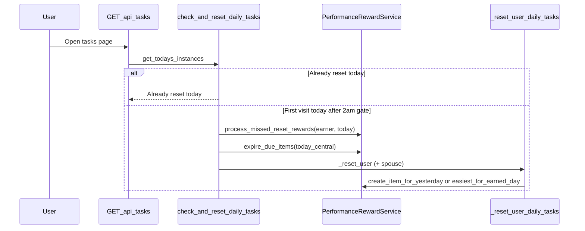

# Daily reset behavior (lazy / on visit)

The app does **not** run a scheduled cron at 2:00 AM Central. The daily reset runs when server code calls `DailyTaskService.check_and_reset_daily_tasks`, mainly when someone loads the tasks page (`GET /api/tasks` → `get_todays_instances`). Manual test endpoints in `app.py` can also trigger it.

## Flow

## Gate rules

Implemented in `src/services/daily_task_service.py` (`check_and_reset_daily_tasks`):

- At most **one reset per user per calendar day** (`daily_task_resets.last_reset_date == today`).
- If local time is **before 2:00 AM** and yesterday already has a reset record → returns early (`Reset not needed yet`) and does **not** reset.
- Otherwise (after 2am today, or before 2am but yesterday never reset) → runs full reset for **today’s calendar date only**.

Performance bonus **expiry** is **not** driven by the frontend. It runs only inside this reset path: `PerformanceRewardService.expire_due_items(today_central)` uses reset calendar days (`created_at_reset_date + 2`), not rolling 48 hours from wall clock.

## Late reset same day (e.g. 1pm instead of 2am)

Fine as long as it is still the **first** reset that calendar day:

| Piece | Behavior |
|--------|----------|
| Performance bonus **expiry** | `expire_due_items(today_central)` — expire when `today_central >= created_at_reset_date + 2` |
| Performance bonus **create** | `create_item_for_yesterday` — only **yesterday** (`today - 1`), doc id `{earner}_{earned_for_date}` |
| Daily task instances | Created for **today** only; existing instances for today are deleted and recreated |
| Task points lock | `lock_daily_threshold_for_date` — **yesterday** only |

A 1pm Tuesday reset is “Tuesday’s reset”: expire what is due through Tuesday, create Tuesday’s daily instances, create bonuses from Monday’s points.

## Skipped day (no one opens the app)

Example: reset runs Sunday; **no visit Monday**; first visit **Tuesday 1pm**.

### Performance bonuses — tiered catch-up

Missed resets are inferred from `daily_task_resets.last_reset_date`: every calendar day `M` where `last_reset_date < M < today` is a missed reset day. Earn day for reset `M` is `M - 1`.

| Missed resets | Example | Earn day with real work | Gap / empty earn days |
|---------------|---------|-------------------------|------------------------|
| **1** | Tasks Mon, skip Tue, open Wed | **Full credit** — pending bonus item(s); `created_at_reset_date =` missed day `M` (not today), so **1 list day** left on Wed | **Easiest** — band 0 owed to ledger only (e.g. Tue when opening Wed) |
| **2+** | Tasks Mon, skip Tue & Wed, open Thu | **Owed points only** — band math, ledger, no list row | **Easiest** for other gap earn days |

**Normal day** (`gap_count == 0`): `create_item_for_yesterday` only (unchanged).

**Expiry:** On the next reset, `expire_due_items(today_central)` still uses `created_at_reset_date + 2`. Catch-up full items use the missed reset day as `created_at_reset_date`, so a late check-in does not restart a 2-day list window.

**Task list:** `get_pending_bonus_items` only reads `status == pending`; it does not expire or convert. Items stay visible until a reset runs `expire_due_items`.

### Daily tasks

`_reset_user_daily_tasks` only deletes/creates instances for **`today_central`**. It does **not** backfill missed days.

Monday’s daily task pool never existed: no template instances for that date. `TaskMaster` only selects instances where `date == today`.

### Other single-day reset effects

Per reset, only **today** is cleared/rebuilt for:

- `task_points_daily` tally (`clear_daily_points_for_reset`)
- `threshold_tracking` for today

## Summary

| Scenario | Bonuses expire | Bonuses created | Daily task instances |
|----------|----------------|-----------------|----------------------|
| Reset 1pm same day | On that day’s reset | Yesterday only | Today only |
| Skip 1+ days, then open | All due on first reset (calendar rule) | Tiered catch-up (see above) | **Only** today; skipped days **lost** |

## Pre-2am edge

If someone opens **Tuesday 1:00 AM** and **Monday’s reset never ran**:

- Code may run Tuesday’s reset (Monday has no `last_reset_date`), but it still builds **Tuesday** instances and only locks/creates bonus for **Monday** — not Monday’s daily instances.

## Not implemented

- No loop that backfills `daily_task_instances` for missed calendar days.
- No cron — reset remains lazy on first visit after the 2am gate.
